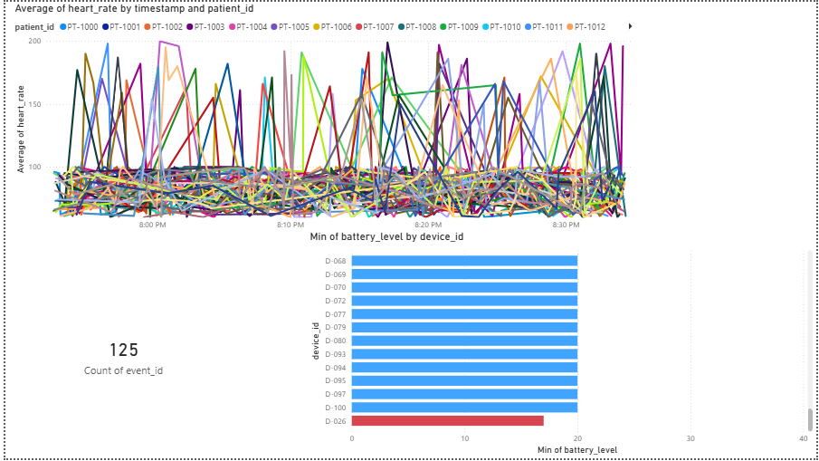

# 🏥 CardioStream: Real-Time Medical IoT Pipeline

### *A scalable IoT data engineering pipeline for simulating, streaming, and visualizing patient vital signs.*

---

## 📖 Project Overview
**CardioStream** is a medical IoT simulation that generates real-time patient health data (Heart Rate, SpO2, Temperature). It processes this stream to detect critical health events and visualizes historical trends using Power BI.

This project demonstrates a full **End-to-End Data Pipeline**:
`Device Simulation` → `Alert System` → `Data Archiving` → `Power BI Visualization`

---
## 📊 Dashboard Preview
<p align="center">
  
</p>

---

## 📂 Project Structure
Based on the actual codebase:

```text
CardioStream/
├── 📂 med_data_lake/              # Storage for archived JSON sensor logs
├── 📄 device_simulator.py         # Generates real-time dummy patient vitals (IoT Source)
├── 📄 alert_system.py             # Monitors stream for anomalies (e.g., SpO2 < 90%)
├── 📄 data_archiver.py            # Batch process to save stream data into the Data Lake
├── 🐳 docker-compose.yml          # Container orchestration for the pipeline
├── 📊 Medtronic_IOStream_Visual.pbix # Interactive Power BI Dashboard
├── 📄 .gitignore                  # Git configuration
└── 📄 README.md                   # Project documentation

🚀 Key Features
IoT Device Simulator (device_simulator.py):

Simulates multiple patient monitoring devices.

Streams JSON data with realistic variability for Heart Rate (BPM), Body Temp, and Blood Pressure.

Real-Time Alerting (alert_system.py):

Ingests the live stream and triggers immediate warnings for critical conditions (e.g., Tachycardia or Hypoxia).

Data Archival (data_archiver.py):

Moves processed data into the med_data_lake for long-term storage and historical analysis.

Power BI Integration:

The .pbix file connects to the data lake to visualize patient trends over time.

🛠️ Tech Stack
Language: Python 3.14

Containerization: Docker (docker-compose)

Visualization: Microsoft Power BI

Data Storage: JSON / Flat File (Data Lake pattern)

Version Control: Git & GitHub

⚙️ How to Run
1. Prerequisite
Ensure you have Python and Docker (optional) installed.

2. Run the Pipeline Locally
You can run the scripts individually to see the data flow:

Bash

# Step 1: Start the simulator (Generates data)
python device_simulator.py

# Step 2: In a new terminal, start the alert system
python alert_system.py

# Step 3: Archive data to the lake
python data_archiver.py
3. Run with Docker (Recommended)
If you have Docker installed, simply spin up the entire environment:

Bash

docker-compose up --build
4. View the Dashboard
Open Medtronic_IOStream_Visual.pbix in Power BI Desktop.

Refresh the dataset to see the latest simulated data points.

🔮 Future Enhancements
Cloud Migration: Move med_data_lake to AWS S3.

Streaming: Replace local Python streaming with Apache Kafka.

Database: Ingest archived data into Snowflake or PostgreSQL for SQL analysis.

Created by Darshana Gathibandhe